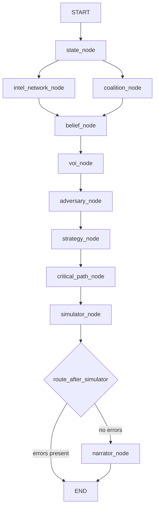
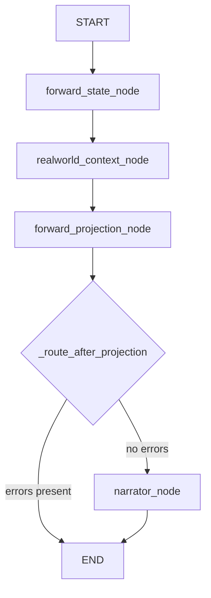
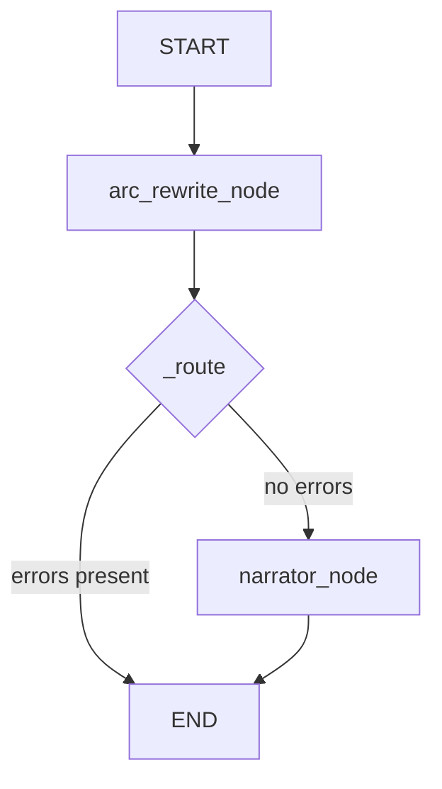

# Multi-Agent System

This page documents the LangGraph-based multi-agent architecture: pipeline topologies, shared state contract, parallel execution, routing, and the Claude narrator integration. For algorithm internals see [Technical Reference](Technical-Reference). For the layer stack and data flow see [Architecture](Architecture).

---

## Overview

`dhurandhar-oracle` uses [LangGraph](https://github.com/langchain-ai/langgraph) to orchestrate a directed graph of agent nodes over a single shared state object (`DhurandharState`). There are three compiled graphs, one per execution mode:

| Graph | File | Mode |
|---|---|---|
| `oracle_graph` | `graph.py` | Turning-point (Mode 1) |
| `forward_graph` | `forward_graph.py` | Forward projection (Mode 2) |
| `rewrite_graph` | `rewrite_graph.py` | Arc rewrite (Mode 3) |

Each node is a pure Python function `(state: DhurandharState) -> dict` that returns only the keys it writes. LangGraph merges the returned dict into the shared state before the next node runs.

---

## Mode 1: Turning-Point Pipeline (`oracle_graph`)

### Topology



### Node Reference Table

| Node | Algorithm | Reads from state | Writes to state |
|---|---|---|---|
| `state_node` | JSON loader + side gate | `operative`, `turning_point` | `state_vector`, `available_actions`, `causal_dag`, `adversaries`, `alliance_snapshot`, `mission_tasks`, `intelligence_targets`, `initial_belief_state`, `turning_point_description`, `real_world_correlation` |
| `intel_network_node` | SNA (NetworkX) | `adversaries`, `alliance_snapshot` | `intel_graph_data`, `centrality`, `threat_scores`, `high_threat_actors` |
| `coalition_node` | Shapley values | `alliance_snapshot`, `state_vector` | `shapley` |
| `belief_node` | HMM (Viterbi + Forward-Backward) | `adversaries`, `high_threat_actors`, `shapley` | `hmm_results`, `belief_gaps` |
| `voi_node` | Shannon entropy VoI | `intelligence_targets`, `initial_belief_state` | `voi_result` |
| `adversary_node` | Stackelberg equilibrium | `available_actions`, `adversaries`, `state_vector`, `belief_gaps` | `stackelberg` |
| `strategy_node` | POMDP PBVI | `available_actions`, `causal_dag`, `adversaries`, `initial_belief_state`, `state_vector`, `stackelberg` | `pomdp` |
| `critical_path_node` | CPM + PERT | `mission_tasks` | `critical_path` |
| `simulator_node` | Monte Carlo | `causal_dag`, `state_vector`, `pomdp`, `action_override` | `simulation_actual`, `simulation_optimal` |
| `narrator_node` | Claude API / template | All computed result keys | `narrative` |

### Parallel Fan-Out / Fan-In

`state_node` has two outgoing edges — to `intel_network_node` and `coalition_node`. LangGraph executes these **concurrently** in separate threads.

Both nodes can write to `errors` and `warnings` simultaneously. These fields use LangGraph's `Annotated[list, operator.add]` reducer, which safely merges concurrent list appends:

```python
errors:   Annotated[list[str], operator.add]
warnings: Annotated[list[str], operator.add]
```

Without this reducer, concurrent writes to the same key would raise a LangGraph conflict error.

`belief_node` acts as the **fan-in** — it waits for both `intel_network_node` and `coalition_node` to complete before executing, because it reads `high_threat_actors` (from SNA) and `shapley.defection_incentives` (from coalition).

---

## Mode 2: Forward Projection Pipeline (`forward_graph`)

### Topology



### Node Reference Table

| Node | Algorithm | Reads from state | Writes to state |
|---|---|---|---|
| `forward_state_node` | JSON loader + side gate | `operative` | `macro_arc` |
| `realworld_context_node` | Context file loader | `macro_arc` | `context_summaries` |
| `forward_projection_node` | Career MDP (backward induction) + Monte Carlo CI | `macro_arc`, `context_summaries`, `horizon_until`, `forced_event_action` | `forward_projection` |
| `narrator_node` | Claude API / template | `operative`, `macro_arc`, `context_summaries`, `forward_projection` | `narrative` |

### Narrator Mode Detection

`narrator_node` is **reused** across all three pipelines. It detects the active mode by checking which result keys are populated in state:

```python
mode = state.get("mode", "turning_point")
if mode == "forward":   system = _FORWARD_SYSTEM;  trace = _build_forward_trace(state)
elif mode == "rewrite": system = _REWRITE_SYSTEM;  trace = _build_rewrite_trace(state)
else:                   system = _SYSTEM_PROMPT;   trace = _build_trace(state)
```

Each mode has its own system prompt, shaping the tone and structure of the Claude output.

---

## Mode 3: Arc Rewrite Pipeline (`rewrite_graph`)

### Topology



### Nested Invocation

`arc_rewrite_node` calls `optimisation/arc_chain.rewrite_arc()`, which **internally invokes `oracle_graph`** (Mode 1) once per turning point. This makes the rewrite pipeline a meta-loop:

```
rewrite_graph
  └── arc_rewrite_node
        └── arc_chain.rewrite_arc(operative_id)
              └── for each turning_point:
                    oracle_graph.invoke({operative, turning_point})  ← full Mode 1 run
                    → read pomdp.action_values
                    → compare vs outcome JSON actual_action
                    → accumulate q_delta
```

This guarantees self-consistency: actual and prescribed Q-values come from the same solver, not different ground truths.

### Node Reference Table

| Node | Algorithm | Reads from state | Writes to state |
|---|---|---|---|
| `arc_rewrite_node` | Arc chain (oracle_graph × N TPs) | `operative`, `forced_tp_action` | `arc_rewrite` |
| `narrator_node` | Claude API / template | `operative`, `arc_rewrite` | `narrative` |

---

## DhurandharState — Full Key Contract

`DhurandharState` is a `TypedDict(total=False)` — all fields are optional at declaration but most are expected to be populated by the time later nodes run. The table below shows the full contract, who writes each key, and which nodes read it.

### Input keys (provided by caller before graph invocation)

| Key | Type | Written by | Read by |
|---|---|---|---|
| `operative` | `str` | CLI | `state_node`, `forward_state_node`, `arc_rewrite_node` |
| `turning_point` | `str` | CLI | `state_node` |
| `mode` | `str` | CLI | `narrator_node`, `forward_projection_node` |
| `horizon_until` | `str` | CLI | `forward_projection_node` |
| `action_override` | `Optional[str]` | CLI `--action` | `simulator_node` |
| `forced_event_action` | `Optional[dict]` | CLI `--force-event-response` | `forward_projection_node` |
| `forced_tp_action` | `Optional[dict]` | CLI `--force-tp` | `arc_rewrite_node` |
| `brief` | `bool` | CLI `--brief` | `narrator_node` |
| `markdown` | `bool` | CLI `--markdown` | `narrator_node` |
| `errors` | `Annotated[list[str], operator.add]` | CLI (initialised `[]`) | `route_after_simulator`, all nodes |
| `warnings` | `Annotated[list[str], operator.add]` | CLI (initialised `[]`) | CLI output |

### state_node outputs

| Key | Type | Description |
|---|---|---|
| `state_vector` | `OperativeState` | 5-dim field state at this turning point |
| `available_actions` | `list[str]` | Discrete action set |
| `causal_dag` | `CausalDAG` | Directed causal graph with edge strengths |
| `adversaries` | `list[AdversaryModel]` | Adversary profiles with Prospect Theory params |
| `alliance_snapshot` | `list[AllianceEdge]` | Network edges at this turning point |
| `mission_tasks` | `list[MissionTask]` | PERT task graph for CPM |
| `intelligence_targets` | `list[IntelligenceTarget]` | VoI input targets |
| `initial_belief_state` | `dict[str, float]` | World state → probability (sums to 1.0) |
| `turning_point_description` | `str` | Scene description text → narrator context |
| `real_world_correlation` | `Optional[dict]` | Grounded real-world event data → narrator context |

### intel_network_node outputs

| Key | Type | Description |
|---|---|---|
| `intel_graph_data` | `dict` | Serialised NetworkX adjacency data |
| `centrality` | `CentralityScores` | Betweenness, eigenvector, clustering, communities |
| `threat_scores` | `list[ThreatScore]` | Composite threat score per actor |
| `high_threat_actors` | `list[str]` | Actor IDs above high-threat threshold |

### coalition_node outputs

| Key | Type | Description |
|---|---|---|
| `shapley` | `ShapleyResult` | φᵢ per asset + defection incentives |

### belief_node outputs

| Key | Type | Description |
|---|---|---|
| `hmm_results` | `list[HMMResult]` | Per-actor Viterbi path + posterior marginals |
| `belief_gaps` | `list[BeliefGap]` | Operative's belief vs HMM inference per actor |

### voi_node outputs

| Key | Type | Description |
|---|---|---|
| `voi_result` | `VoIResult` | Ranked intelligence targets by entropy reduction |

### adversary_node outputs

| Key | Type | Description |
|---|---|---|
| `stackelberg` | `StackelbergResult` | Leader commitment, best responses, commitment value |

### strategy_node outputs

| Key | Type | Description |
|---|---|---|
| `pomdp` | `POOMDPResult` | Optimal action, action values Q(b,a), success probabilities |

### critical_path_node outputs

| Key | Type | Description |
|---|---|---|
| `critical_path` | `CriticalPathResult` | Critical path, bottleneck, days saved, parallelisation |

### simulator_node outputs

| Key | Type | Description |
|---|---|---|
| `simulation_actual` | `Optional[SimulationOutput]` | MC results for the outcome action |
| `simulation_optimal` | `Optional[SimulationOutput]` | MC results for the POMDP-optimal action |

### narrator_node outputs

| Key | Type | Description |
|---|---|---|
| `narrative` | `str` | Claude briefing or Rich template fallback |

### Forward / Rewrite mode keys

| Key | Type | Written by | Description |
|---|---|---|---|
| `macro_arc` | `MacroArc` | `forward_state_node` | Post-D2 career arc data |
| `context_summaries` | `list[dict]` | `realworld_context_node` | Event → bullet context lines |
| `forward_projection` | `ForwardProjection` | `forward_projection_node` | Predicted + prescribed trajectories |
| `arc_rewrite` | `ArcRewrite` | `arc_rewrite_node` | Per-TP counterfactual + cumulative Q-delta |

---

## Routing Functions

Conditional edges in LangGraph call a routing function that inspects state and returns a node name or `END`.

| Router | Location | Logic |
|---|---|---|
| `route_after_simulator` | `state.py` | If `state["errors"]` non-empty → `"end"` (→ `END`), else → `"narrator"` |
| `_route_after_projection` | `forward_graph.py` | Same pattern for Mode 2 |
| `_route` | `rewrite_graph.py` | Same pattern for Mode 3 |

All three routers use the same `errors` list as the signal. Any node can add to `errors` to abort the pipeline and prevent the narrator from running on corrupted state.

---

## Claude Narrator Integration

`narrator_node` (`agents/narrator_node.py`) is the only node that calls the Anthropic API.

### Input trace construction

Each mode serialises a different subset of state into a JSON trace passed as the user message:

**Turning-point trace** (`_build_trace`):
```python
trace_keys = [
    "operative", "turning_point",
    "turning_point_description", "real_world_correlation",
    "pomdp", "critical_path", "voi_result", "stackelberg",
    "belief_gaps", "shapley", "simulation_actual", "simulation_optimal",
    "threat_scores", "warnings",
]
```

**Forward trace** (`_build_forward_trace`): `operative`, `macro_arc`, `context_summaries`, `forward_projection`

**Rewrite trace** (`_build_rewrite_trace`): `operative`, `arc_rewrite`

Raw graph data (`intel_graph_data`) is excluded — it is too large and contains no additional signal beyond the derived `centrality` and `threat_scores`.

### System prompts

| Mode | System prompt role |
|---|---|
| Turning-point | RAW war-room analyst briefing the NSA. Covers 7 sections: optimal action, CPM, VoI, Stackelberg, mole alerts, Shapley, Monte Carlo delta. Tone: clipped, classified-document. |
| Forward | RAW strategic-analysis writer. Narrative grouped by year, divergence events highlighted, `[SPECULATIVE]` banner if real public figure. |
| Rewrite | RAW counterfactual analyst. Per-act commentary on what changed, closing synthesis on cumulative outcome shift. |

### Model selection

```python
model = "claude-haiku-4-5-20251001" if state.get("brief") else "claude-sonnet-4-6"
max_tokens = 1024 if brief else 2048
```

`--markdown` appends `"\nFormat the response as Markdown with H2/H3 headings; LinkedIn-paste-friendly."` to the system prompt.

### Fallback (no API key)

If `ANTHROPIC_API_KEY` is not set, `narrator_node` warns and uses a Rich-formatted template:
- `_template_narrative()` — plain text for turning-point mode
- `_template_narrative_markdown()` — Markdown for `--markdown` flag
- `_template_forward()` — turning-point comparison table for Mode 2
- `_template_rewrite()` — per-TP counterfactual table for Mode 3

All quantitative results (POMDP values, critical path, VoI rankings, Stackelberg payoffs, Monte Carlo delta) are included in the template output. Only the narrative synthesis differs.
